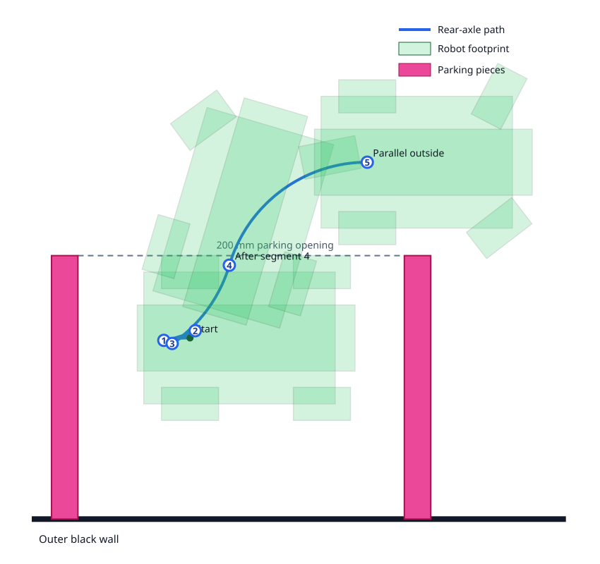

# Parking Exit Path Simulation

**Project:** WRO Future Engineers 2026 robot  
**Date:** August 2026  
**Status:** Prototype path found; staged physical validation in progress

## 1. Purpose

[`parking_exit_swept_search.py`](parking_exit_swept_search.py) is the offline
geometry program used to replace the original forward-first parking exit. The
original route touched the forward magenta parking block after only 34 mm of
travel in the proportional parking gap.

The program searches for a low-speed multi-point path that moves the complete
robot footprint out of the parking lot without intersecting either magenta
block or the outer black wall. It is a feasibility and path-design tool. It
does not run on the robot and does not replace physical clearance testing.

## 2. Coordinate system

- `x` points in the intended driving direction.
- `y` points away from the outer black wall and toward the parking opening.
- The inside face of the rear magenta block is at `x = 0`.
- The parking opening is at `y = 200 mm`.
- A pose describes the rear-axle midpoint and chassis heading.

The opposite driving direction uses the same geometry mirrored laterally. In
firmware, mirroring is achieved by reversing the sign of every nonzero
steering command.

The simulation uses parking-local coordinates, but production localization
transforms them into the canonical field frame according to Rules Figures 3
and 4. The randomly selected starting section is treated as the canonical
south section. Its straight runs from `x=-500` to `x=+500`; the right magenta
piece is fixed immediately left of the `x=+500` dotted boundary, spanning
`x=480..500`. The variable left piece is placed one parking-gap length farther
left. The open ends of both pieces are at canonical `y=-1300`, 200 mm inward
from the outer wall at `y=-1500`.

## 3. Prototype geometry

| Input | Value |
|---|---:|
| Rear axle to foremost point | 125 mm |
| Rear axle to rearmost point | 40 mm |
| Overall prototype length | 165 mm |
| Physical wheelbase | 100 mm |
| Track half-width | 50 mm |
| Wheel diameter | 43.2 mm |
| Wheel width | 25 mm |
| Maximum measured envelope width | about 135 mm |
| Parking depth | 200 mm |
| Magenta-block thickness | 20 mm |
| Nominal inside-face gap | 247.5 mm |
| Minimum checked gap | 242.5 mm |
| Placement tolerance | approximately +/-5 mm |

The three August 2026 top-down photographs in `local_workspace` were used to
identify which regions are actually occupied. The robot is therefore not
treated as a solid 165-by-135 mm rectangle. Its footprint is the union of:

1. A central chassis rectangle.
2. A narrow centre strip containing the front and rear protrusions.
3. Two rear-wheel rectangles.
4. Two independently rotated front-wheel rectangles.

This distinction is essential because the empty bounding-box corners provide
the space needed for the multi-point manoeuvre. The current photographs show
manually approximated near-lock steering and are supporting evidence, not
final dimensional calibration.

## 4. Ackermann motion model

The search uses three steering controls: `-50`, `0`, and `+50`. Full-lock
front-wheel angles come from the repository's Ackermann model:

| Servo command | Left wheel | Right wheel |
|---:|---:|---:|
| -50 | -37.545 degrees | -62.455 degrees |
| 0 | 0 degrees | 0 degrees |
| +50 | +62.455 degrees | +37.545 degrees |

The rear-axle midpoint follows a constant-curvature arc with an approximate
109 mm full-lock radius. A motion primitive advances 5 mm either forward or
reverse. For collision checking, every primitive is subdivided into five 1 mm
steps so that a collision between the endpoints cannot be skipped.

This kinematic model predicts the geometric path. It does not model tire slip,
servo settling, motor acceleration, braking overshoot, or wheel deformation;
those effects must be measured on the real robot.

## 5. Collision checking

At every sampled pose the program:

1. Rotates the front-wheel polygons to their Ackermann angles.
2. Transforms all six footprint polygons into field coordinates.
3. Rejects poses that approach the outer wall beyond the configured margin.
4. Uses the separating-axis theorem to test every footprint polygon against
   both magenta-block rectangles.

Margins are directional rather than an isotropic enlargement of the complete
parking pieces:

- The outer black wall retains 5 mm safety clearance.
- The broad faces of each magenta piece retain 5 mm safety clearance.
- The open end of each magenta piece remains at its measured 200 mm length;
  the general 5 mm margin does not make the piece artificially longer.

The model checks 16 tolerance combinations: minimum/maximum plausible parking
gap, `+/-5 mm` initial `x` and `y` placement, and `+/-1` degree initial heading.
These checks reduce risk but do not establish competition-ready clearance.

## 6. Search algorithm

The program performs a bounded Hybrid-A*-style search. Each state contains:

- Quantized rear-axle `x`, `y`, and heading.
- Current forward or reverse direction.
- Current steering command.
- Length of the current unchanged control segment.

The search expands all combinations of forward/reverse and left/straight/right
motion. A control must be held for at least 20 mm before changing direction or
steering, because 5-10 mm commands are not reliably reproducible on the real
drivetrain. Direction changes receive a larger cost penalty than steering
changes, favouring a shorter and simpler route.

The goal is reached once the physical robot footprint is completely beyond the
200 mm parking opening, approximately parallel to the original heading, and
with straight steering. Consecutive identical primitives are combined into
firmware-sized segments.

## 7. Selected prototype path

The selected start has 50 mm between the robot's rearmost point and the rear
magenta block's inside face. With the nominal 247.5 mm gap, this leaves 32.5 mm
in front. The side of the straight robot is placed at the parking opening, as
far from the black wall as possible while remaining inside the parking lot.
This is 5 mm farther forward than the first successful tests, giving the first
reverse movement more physical and placement-error clearance. The revised
start still passes all 16 modeled tolerance combinations.

Controls below are relative to the outer wall:

| Segment | Direction | Steering | Distance |
|---:|---|---|---:|
| 1 | Reverse | Toward wall | 20 mm |
| 2 | Forward | Away from wall | 25 mm |
| 3 | Reverse | Toward wall | 20 mm |
| 4 | Forward | Away from wall | 75 mm |
| 5 | Forward | Toward wall until parallel | about 140 mm modeled |

After segment 4, the robot has cleared enough of the 200 mm piece ends to use
one continuous full-lock arc outside the parking lot. In the geometric model,
140 mm removes the remaining 73.6 degrees of heading. Firmware uses the gyro
rather than assuming the simulated radius exactly: it may stop from 120 mm
once heading error is at most 2 degrees, and must stop by 180 mm.

The five-segment path passed all 16 modeled tolerance combinations.



The blue curve is the rear-axle path. Numbered circles mark segment endpoints.
Green outlines show the physical robot at the start, after segment 4, and when
parallel outside the parking lot. Pink rectangles retain their exact 200 mm
length in the driving model.

## 8. Firmware and physical validation

The path table is implemented in `src/obstacle.cpp`. Configuration and the
staged safety gate are in `include/config.h`:

```cpp
constexpr auto OBSTACLE_PARKING_EXIT_TEST_SEGMENT_LIMIT = 5;
```

The robot settles the steering before every segment. At the target distance it
briefly holds the encoder position to avoid an uncontrolled coast, then
disables the drive and logs target distance, actual distance, heading change,
and side-ToF readings.

`log_117.txt` is the first physical validation. Segment 1 was commanded for
20.0 mm and stopped after 22.3 mm with a 10.4-degree heading change. The user
reported that it looked good and made no contact. The 2.3 mm excess is small
enough to proceed to the next staged test, but it remains part of the physical
trajectory and must be considered when validating segment 2.

`log_120.txt` completed all seven segments without physical contact. Actual
segment travels were 24.0, 28.6, 20.5, 78.1, 59.5, 25.0, and 80.2 mm. The
individual arcs broadly followed the model, but the final heading error was
7.7 degrees instead of approximately zero. In particular, the last 80.2 mm
full-lock arc changed heading by about 37.4 degrees rather than the roughly
45 degrees required from its measured starting heading. This validates the
collision-free shape for this direction but shows why the final alignment
must use bounded gyro feedback rather than an uncorrected simulated distance.

The replacement route retains segments 1-4 from this successful run and
combines former segments 5-7 into one continuous final arc. This reduces two
unnecessary stops and lets the gyro finish parallel outside the parking lot.
It is not physically accepted until the new five-segment isolated test passes.

`log_122.txt` physically accepts the five-segment route from the former 45 mm
rear-clearance placement. Segment 5 aligned successfully after 162.6 mm and
the final logged heading error after braking was 0.9 degrees. The complete exit
had no contact or intervention. Its right ToF ended at 69 mm while the sensor
was positioned over the adjacent magenta piece, making the exact 200 mm open
end a useful candidate field reference.

## 9. Running and updating the simulation

The script uses only the Python standard library:

```powershell
py -3 CAD/parking_exit_swept_search.py
```

Re-run and physically revalidate the path whenever any of these changes:

- Robot length, overhang, width, or wheel location.
- Steering linkage, servo endpoints, or measured turning radius.
- Wheel dimensions or another component enters the swept envelope.
- Required placement tolerance or safety margin.
- Official parking geometry.

Before final competition acceptance, replace the approximate footprint with
measurements from commanded `-50`, `0`, and `+50` overhead photographs and
validate the complete path in both mirrored directions.

## 10. Rules-aware post-exit pose

The fixed right piece makes the parked start coordinate known even though the
parking lot is not centred on the straight. With the 247.5 mm prototype gap and
50 mm rear clearance, the canonical rear-axle starts are:

- CCW/east: `(322.5, -1362.5, 0 degrees)`.
- CW/west: `(390.0, -1362.5, 180 degrees)`.

Encoder/gyro odometry carries the along-straight `x` coordinate through the
five-segment exit. At the aligned end, the outer-wall-side ToF measures the
exact `y=-1300` parking-piece end. Firmware heading-compensates that range and
corrects only field `y`; it retains odometry `x`. Before applying that
correction, it transforms the sensor's documented 22-degree near-range
detection footprint into field `x` from the estimated rear-axle pose, heading,
calibrated sensor origin, and measured range. The CCW/right-sensor footprint
must intersect the fixed piece at `x=480..500`; the CW/left-sensor footprint
must intersect the moving piece at `x=212.5..232.5`. Both checks allow 5 mm
for the measured placement tolerance. A short return whose footprint misses
the expected interval is logged but cannot alter the pose. This avoids the invalid old
assumption that every exit starts at the midpoint of the 1000 mm straight.
The full corrected pose is logged before any Pure Pursuit join is enabled.

The active x-localization implementation retains the ruler-validated 50 mm
rear placement for departure safety. After final alignment and the magenta-end
y reference, the robot centres its steering and reverses at 60 mm/s for at
most 60 mm. This crosses the opposite edge of the same magenta piece and also
leaves additional forward approach distance for the later starting-section
discovery connector. Only returns no more than 50 mm beyond the initial
magenta range can update the last marker observation. Intermediate oblique
returns are ignored. Two fresh raw ranges in `190..400 mm` must also agree
within 25 mm with the wall distance predicted from the current field pose.

Because the crossing direction changed, the referenced edges also change. A
CCW reverse uses the fixed piece's `x=480` edge and the maximum x edge of the
ToF footprint. A CW reverse uses the moving piece's `x=232.5` prototype edge
and the minimum x edge of the footprint. X and wall-derived y corrections are
each bounded to 25 mm. The swept model includes the complete 60 mm reverse and
passes all 16 gap/placement/heading tolerance cases. The movement must still
be physically accepted in both directions before joining the lap.

After logs 136 and 137 physically accepted that reverse, the model was extended
with a test-only starting-section discovery path. It does not assume that the
parking section is empty: under Figure 8e only the outer member of each seat
pair is known clear, while the inner member remains unknown.

The parking position is asymmetric along the 1000 mm straight, so two entry
paths are required:

- CCW reverses straight until the corrected rear-axle field coordinate reaches
  approximately `x=60 mm`, then follows a 40 mm reverse arc toward S0 station 2.
- CW reverses straight until approximately `x=520 mm`, then follows the mirrored
  40 mm reverse arc toward S0 station 1.

The arc radius is 109 mm and is sampled as Pure Pursuit waypoints; firmware
commands negative speed rather than using a steering override. Both complete
exit-plus-discovery envelopes pass all 16 gap, placement, and heading tolerance
cases. At the final pose the relevant inner seat is inside the calibrated
camera angle and 230--600 mm range. The first powered version stops there,
waits up to 1200 ms for two clear frames or colour votes, logs
`CLEAR`, `RED`, `GREEN`, or `UNKNOWN`, and locks the motor. A colour-dependent
forward join is intentionally deferred until this scan motion and observation
are physically validated.
